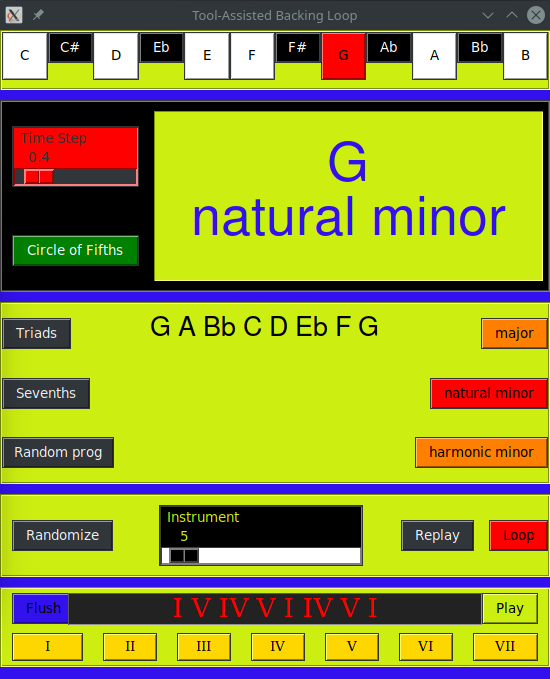

# TABL
Tool-Assisted Backing Loop

A simple music tool that generates chords progression based on a tonic key and a scale (that both may be either chosen or picked randomly).

This works with `Tkinter` for the GUI, and `fluidsynth` for the sound. You may need to change the audio driver for your operating system. `PulseAudio` should work on modern Linux distributions. 

You can change the soundfont to another (by default, this program uses `TimGM6mb.sf2` which is light enough to be provided within a github repository).

  

## TO DO

* Features:
    * Make a loop on selected chord progression
    * Let the user choose the time step
    * Add a button to see all triads
    * Add a button to see all sevenths
    
* GUI:
    * Improve scale display by putting a tabulation for each semitone not valid in a scale
    * When playing a chords, change color of played notes in the scale label
    * Make fontground color reverse to background color
    * Gridify the layout of widget
    * Auto-reconfigure the layout to correspond to what is played when pressing replay button (determine scale and tonic to refresh layout)
    * Design a background (like VST ones ?)
    * Fix the state delay after stopping a loop
    
* Music engine:
    * Build a transcoder from binary representation of tones into actual scale (i.e. 101011010101 = Major)
    * Fix octave drift when playing triads

## Done

* Features:
    * Randomly generate a tonic and a scale
    * Play the scale and print the valid notes
    * Add a button to randomize again
    * Add a replay button
    * Let the user choose a tonic note
    * Add a button to listen all triads of the current scale and last selected tonic
    * Let the user choose a scale
    * Add a button to listen all sevenths
    * Generate a random chord progression
    * Let the user choose instrument with a slider
    * Make the replay button replay the last thing played (note only the current scale, but also last chord progression)
    * Make a loop on last chord progression

* GUI:
    * Make the tonic change the color (e.g. A = 440 Hz, add 0x440 to the hexacode of a scale)
    * Print the current note being played
    * Print the current chord being played
    * Fix screen synchronization with event
    * Block all buttons when music play
    * Indicate which tonic and scale are currently selected
    * When changing scale, automatically print the new valid notes
    
* Music engine:
    * Build a function that play notes
    * Build a function that play chords
    * Build a function that play scale
    * Build a function that play all triads within a given scale
